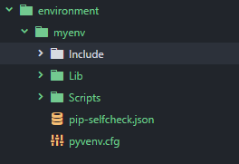
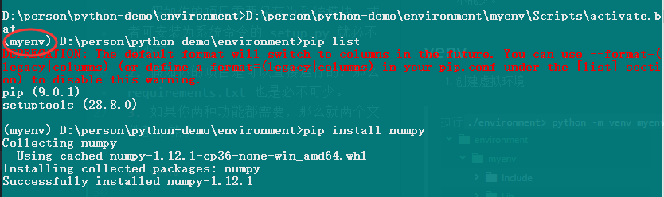

## setup.py(setuptools Distutils2)
> `setup.py `是为可发行的Python库那些包准备的

## requirements.txt(pip)
> `requirements.txt` 是为那些不被经常作为工具利用的Python应用准备的
> 1. 生成`requirements.txt`命令`pip freeze >requirements.txt`
> 2. 安装`requirements.txt`依赖包命令`pip install -r requirements.txt`

## `requirements.txt` vs `setup.py`
1. 假如你的项目需要保存为系统模块，或者可安装为系统命令的 setup.py 就必不可少了
2. 假如你的项目是可以直接运行的，那么 requirements.txt 也是必不可少。
3. 如果你两种功能都需要，那么就两个文件都不能少。

## venv

1. 创建虚拟环境
> 执行`./environment> python -m venv myenv`
>

> 

2. 启动虚拟环境
执行`/Scripts/activate.bat`文件(mac: source <venv>/bin/activate)
> 
>
> 命令行出现`(venv)`标志已在虚拟环境
>
> 1. 注：使用绝对路径执行activate.bat文件
> 2. 注：使用`'python -m pip install --upgrade pip'`命令更新`pip`,在虚拟环境里，千万别用`'pip install --upgrade pip'`更新`pip`，这会破坏`pip`

3. 退出虚拟环境
执行`/Scripts/deactivate.bat`文件
> 注：使用绝对路径执行deactivate.bat文件
