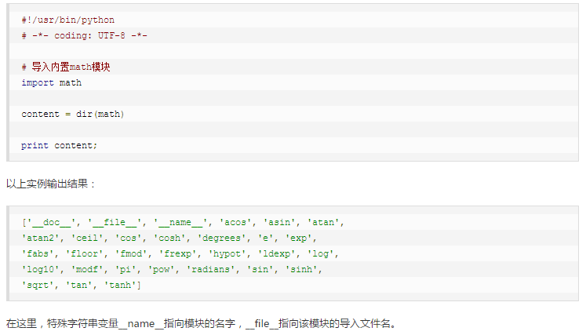

## [模块系统](./demo/module)

```python

直接执行某个.py文件的时候，该文件中那么”__name__ == '__main__'“是True,但是我们如果从另外一个.py文件通过import导入该文件的时候，这时__name__的值就是我们这个py文件的名字而不是__main__。

```

## dir() 返回在一个模块里定义的所有模块，变量和函数

## globals()

## locals()

## reload()
