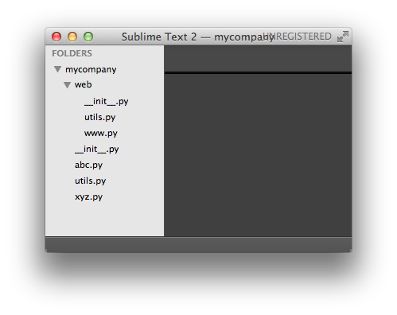

一个`abc.py`的文件就是一个名字叫`abc`的模块

，每一个包目录下面都会有一个`__init__.py`的文件，这个文件是必须存在的，否则，`Python`就把这个目录当成普通目录
文件`www.py`的模块名就是`mycompany.web.www`，两个文件`utils.py`的模块名分别是`mycompany.utils`和`mycompany.web.utils`

应该避免使用`from ... import ...` 而使用`import`语句
